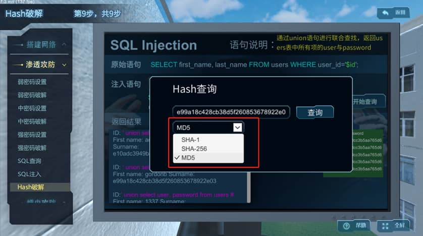

# [基于蜜罐技术的网络空间安全系统虚拟仿真实验](#load)

## 一、实验基本信息
| 属性           | 内容                                         |
| -------------- | -------------------------------------------- |
| **所属专业类** | 计算机类                                     |
| **对应专业**   | 网络空间安全                                 |
| **课程类型**   | 专业核心课                                   |
| **实验类型**   | 综合设计型                                   |
| **所属课程**   | 网络入侵检测与防御、计算机网络、网络攻防对抗 |

---

## 二、实验概述
本实验基于《计算机网络》《网络入侵检测与防御》《网络攻防对抗》等课程，通过虚拟仿真技术实现以下特色：
- 🛡️ **高仿真场景**：还原密码攻击、SQL注入、蠕虫攻击等真实网络攻防场景
- 🎯 **攻防双重视角**：支持从攻击者、防御者、监控者多维度参与攻防对抗
- 📊 **数据可视化**：实现网络信息流、攻击路径、病毒传播动态可视化
- ⚡ **安全实验环境**：避免真实实验对网络设备造成的不可逆破坏

---

## 三、实验教学目标
1. **知识目标**  
   - 掌握网络空间安全知识体系与法律法规
   - 理解蜜罐技术原理及蜜网架构设计方法

2. **技能目标**  
   - 具备网络拓扑设计与蜜罐部署能力
   - 掌握渗透攻击防御与漏洞修复技术
   - 熟练进行攻击信息捕获与溯源分析

3. **素养目标**  
   - 培养网络安全防御体系构建思维
   - 提升网络攻防实战与科研创新能力

---

## 四、实验原理
本课程采用**Unity3D**、**人机交互**、**虚拟现实**等先进手段，实现了基于**蜜罐技术**的网络安全虚拟仿真实验。具体而言：

1. **场景虚拟化**：学习者通过虚拟仿真技术，搭建与真实场景等效的网络环境，包括真实场景、网络设备及局域网络等。
2. **密码攻击与分析**：在等效网络环境下，学习者对不同安全强度的密码进行攻击，通过比较分析，归纳出科学的密码设置方法。
3. **蠕虫病毒仿真**：学习者控制蠕虫病毒的种类、繁殖速度等变量，观察其传播过程，积累关于蠕虫病毒感染主机和网络设备的数量和种类的知识，建立蠕虫病毒模型，分析蠕虫攻击对网络性能的影响，并推理出防御方法。

本课程综合运用了**等效法**、**分类法**、**比较法**、**归纳法**、**控制变量法**、**观察法**、**积累法**、**模型法**、**科学推理法**等多种实验方法，通过仿真病毒攻击、网络渗透以及网络攻防对抗全过程，避免了实验操作对真实信息系统可能造成的破坏及产生的严重后果，解决了实验环境的安全问题。

通过信息流和网络攻击影响的可视化，本课程有助于深化对网络攻防相关原理的理解，增强网络攻防实战化体验，提升实验教学效果。同时，对在线答题、参数设置、人机交互操作结果进行记录和分析，易于实现对实验结果的快速评估，方便考核学习效果，有利于针对学习薄弱环节及时进行改进。

本课程涵盖了以下6个知识点：

1. **局域网络搭建**：了解各种网络设备功能和用途，掌握设计不同的局域网络拓扑结构，以及服务器、网关、路由器等设备的参数设置和网络连通性测试方法。
2. **蜜罐部署**：掌握在实际场景中根据具体的局域网络拓扑结构来部署蜜罐和组建蜜网的流程，以及配置蜜罐和蜜网相关网络参数的方法。
3. **密码与SQL注入攻击**：了解弱密码带来的安全威胁、SQL注入的原理及其危害，掌握强密码的设置原则，理解如何计算密码的安全强度以及识别SQL注入攻击语句。
4. **蠕虫病毒攻击**：了解蠕虫病毒的危害，掌握蠕虫病毒的攻击特点和攻击手段，以及常用的蠕虫病毒防范措施和方法。
5. **蠕虫攻防仿真**：了解利用蜜罐来设置诱饵捕获攻击信息流，掌握根据信息流来分析蠕虫特征的方法，并设置相应的监听措施。
6. **网络攻击溯源与漏洞修复**：掌握利用蜜罐捕获的攻击者信息进行攻击溯源和病毒代码获取，以及通过分析病毒代码对系统的相关漏洞进行及时修复的方法。

---

## 五、实验操作指导

- 局域网搭建
  - 放置设备
    - 红框内不同颜色代表不同的房间，将设备拖动放到对应的房间中
    
      
  
- 连接网络
  
  - 点击设备，连接网络。将路由器依次连接电脑、服务器以及网关
  
    
  
    
  
- 设置网络

  - 如将WAN设置成202.204.80.0

    

- 如将LAN设置成192.168.1.0

  

- 网络起始地址和结束地址分别设置成1、254

  

- 安装蜜罐

  - 点击拖拽蜜罐图片到网关上，安装蜜罐。

    

- 组建密网

  - 点击添加路由或添加主机按钮，组建密网。

    

- 测试网络

  - 点击任意设备，进行网络测试。点击发送按钮发送消息。

    

- 渗透攻防

  - 弱密码设置

    - 根据提示，输入弱密码。

      

- 弱密码破解

  - 根据所设置的密码，改变红框内的参数，以便密码破解。

    - 强密码设置与破解操作同上。

      

- SQL查询、SQL注入

  - 红框中，选择不同的SQL注入，点击开始查询。

    

- 点击红框内的文字，查询Hash值。

  

- Hash破解

  - 选择加密方式，进行Hash查询

    

- 蠕虫攻防

  - 根据所设置的密码，改变红框内的参数，以便密码破解。

    - 强密码设置与破解操作同上。

      

- 初次攻击

  - 根据提示，点击闪烁的主机，进行第一次攻击。

    

- 二次攻击

  - 根据提示，点击闪烁的主机，进行第二次攻击。

    

- 根据提示，点击黄色警报，进行分析。

  

- 修改服漏洞

  - 依次点击红框内三个按钮，进行漏洞修复。

    

## 六、实验结果和结论

#### **实验课程设计理念**

在本实验课程中，不同的虚拟仿真实验教学模块因教学实验目的的差异，对实验与结论的要求也有所不同。为达成国家虚拟仿真实验平台所倡导的“自主探索”和“自主设计”目标，我们针对两类核心实验模块设计了相应的教学方案：

#### **网络攻击技术实验**

对于网络攻击技术实验，我们要求学生在学习相关内容后，按指定步骤完成实验操作，并达到一定的熟练程度。这一要求确保学生能够充分掌握网络安全的基础知识。

#### **网络防护实验**

对于网络防护实验，我们要求学生分析具体的实验步骤，并进行正确的操作。这需要学生具备开放性思维，并根据具体任务选择合适的操作条件来完成实验任务。实验系统将自动记录学生的操作数据，生成实验报告，并提供定量评判结果。

#### **自主探索与自主设计**

本实验课程的“自主探索”或“自主设计”主要体现在以下方面：

1. **不同的网络拓扑**：学生可以根据实际需求设计和搭建不同的网络拓扑结构。
2. **多样的安全需求**：学生需要根据不同的安全需求，选择和配置相应的安全措施。
3. **广泛的应用场景**：学生可以在多种应用场景下进行实验，包括模块2局域网搭建、模块3渗透攻防仿真、模块4蠕虫攻防仿真等。

#### **实验方案设计**

根据上述需求，我们设计了三种不同的实验方案，以分析相应的结果与结论：

1. **方案一**：针对基本的网络安全需求，设计并搭建一个简单的网络拓扑结构，进行基础的网络攻击和防护实验。
2. **方案二**：针对复杂的网络环境，设计并搭建一个中等复杂度的网络拓扑结构，进行更深入的网络攻击和防护实验。
3. **方案三**：针对高级别的安全挑战，设计并搭建一个高复杂度的网络拓扑结构，进行高级的网络攻击和防护实验。

通过以上三种方案，学生可以在不同的应用场景下进行实验，从而获得三种不同的实验分析结果，全面提升其网络安全技能和实践能力。

🔽以下为虚拟仿真实验链接：

[基于蜜罐技术的网络空间安全系统虚拟仿真实验](https://www.ilab-x.com/details/page?id=6368&isView=true)

